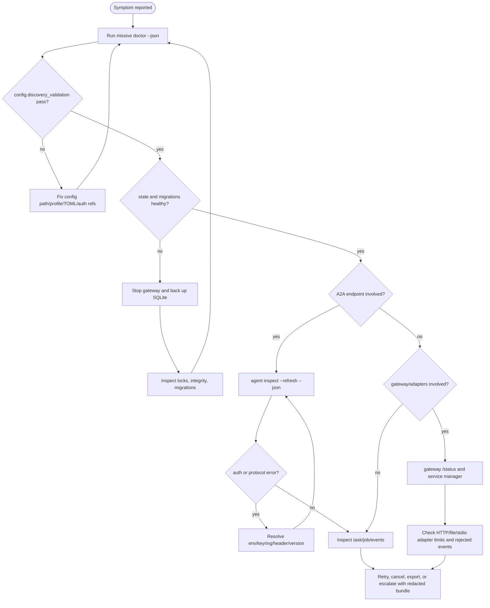

# Runbook

This runbook is for operators and maintainers who need to diagnose or recover a
local `missive` profile, gateway daemon, adapter ingress, or A2A communication
workflow. It complements the user-facing [troubleshooting guide](troubleshooting.md)
with repeatable operational steps.

## Safety rules

* Keep `MISSIVE_HOME`, SQLite databases, logs, adapter inbox/outbox directories,
  exported artifacts, and service-manager files out of the repository.
* Do not paste real tokens, callback credentials, private endpoint URLs, or
  private source identities into issues, docs, commits, logs, or event metadata.
* Prefer read-only diagnostics first: `doctor`, `logs`, `events list`,
  `events replay`, gateway `/status`, and SQLite integrity checks.
* Before manually editing or deleting local state, stop the gateway/webhook,
  take a backup copy of the selected profile database, and record the commands
  used.
* Treat adapter inputs, webhook payloads, event rows, messages, tasks, and
  artifacts as untrusted local runtime data even when stdout/stderr are redacted.

## Quick triage

Run these commands before narrowing the incident. Use the same `--config`,
`--profile`, and `MISSIVE_HOME` that the failing workflow uses.

```bash
missive doctor --json
missive logs --limit 50 --json
missive events list --limit 50 --json
missive events replay --json
```

If the gateway should be running, also check the local status endpoint:

```bash
curl -fsS http://127.0.0.1:7347/status
```

When you need deeper stderr diagnostics for one reproduction, enable safe JSON
logs and avoid logging raw payloads yourself:

```bash
MISSIVE_LOG_FORMAT=json RUST_LOG=missive=debug missive doctor --json
missive --trace agent inspect echo --refresh --json
```

## Triage flow



## Diagnostic matrix

| Symptom | First checks | Likely causes | Recovery |
| --- | --- | --- | --- |
| `doctor` exits `78` | `missive doctor --json`; inspect `config.discovery_validation` | wrong `--config`, disabled repo-local config, TOML typo, invalid routing/adapter/auth ref | fix the config file, rerun with explicit `--config`, keep secrets in env/keyring refs only |
| `doctor` exits `75` | `store.sqlite_migrations`, `state.paths` | unmigrated/stale/future SQLite schema, corrupt database, unavailable state path | stop daemon, back up database, run integrity check, rerun a stateful command to migrate if safe |
| command reports lock contention | `state.paths.locks_dir`; process list; gateway service status | another missive command, gateway, or webhook owns the profile lock | wait for foreground command, stop gateway/webhook, or use another profile/home; do not delete locks while a process is alive |
| A2A request exits `76` | `agent inspect --refresh --json`; event type `a2a.*` | unsupported A2A version, malformed response, binding mismatch | set `--protocol-version`, refresh Agent Card, force a supported `--binding`, reproduce with local mock if needed |
| A2A request exits `77` | auth-related check data and stderr | missing env var, unavailable keyring, malformed header | export the expected env var in the same process scope, provision the keyring entry, or correct auth-ref config |
| endpoint/gateway exits `69` | `a2a.endpoints`, `gateway.status`, `curl /status` | remote unavailable, wrong base URL, gateway stopped, wrong bind address | restart local gateway, correct config URL/bind address, verify firewall/proxy/tunnel outside missive |
| `task wait` exits `82` | `task get --remote`, `events list --task`, gateway subscriptions | remote task still running, stale local row, subscription backoff | rerun wait with longer timeout, refresh task remotely, inspect gateway subscription events, cancel if appropriate |
| background job stuck retrying | `missive job show`, `missive events list --source gateway:jobs --limit 20 --json`, `/status` | gateway not running, stale running lock, remote/protocol failure, unauthenticated gateway job limitation | start gateway, cancel and enqueue foreground/authenticated work, or wait for bounded backoff |
| HTTP adapter returns `401`/`429`/`400` | gateway `/adapter/http/healthz`; rejected events | missing token, rate limit, oversized body, schema error | fix header/token, reduce body, wait for rate window, validate `missive.http.v1` frame |
| webhook callback rejected | webhook NDJSON output; `a2a.push.rejected` events | invalid JSON, missing/mismatched auth, wrong path/tunnel | align push callback URL and `--auth-token-env`, retry with local POST fixture, rotate callback credential if exposed |

## Config and profile recovery

1. Discover what missive is actually loading:

   ```bash
   missive doctor --json
   missive --config /path/to/config.toml --profile default doctor --json
   MISSIVE_REPO_CONFIG=1 missive doctor --json
   ```

2. Verify discovery precedence before editing files: explicit `--config`,
   `MISSIVE_CONFIG`, repository-local config only when `MISSIVE_REPO_CONFIG=1`,
   XDG config files, then built-in defaults.
3. Validate auth refs without printing token values. For env-backed refs, export
   the variable only in the shell or service scope that runs missive. For
   keyring-backed refs, provision the OS keyring entry with platform tooling.
4. If config-seeded agents were removed from the file but remain in SQLite, treat
   them as stale local registry rows until a future reconciliation command exists;
   use a clean profile when exact config-only state is required.

## Storage and lock recovery

Find the selected database path from doctor output:

```bash
DB=$(missive doctor --json \
  | jq -r '.data.checks[] | select(.id == "state.paths") | .data.database_path')
echo "$DB"
```

If `jq` is unavailable, read `state.paths.data.database_path` from the JSON
output manually.

Before manual recovery, stop long-running processes that may write the same
profile:

```bash
missive gateway stop 2>/dev/null || true
# or stop the foreground gateway/webhook process with Ctrl-C
```

Back up the database before destructive inspection or migration experiments:

```bash
mkdir -p /tmp/missive-backups
cp -- "$DB" "/tmp/missive-backups/$(basename "$DB").$(date -u +%Y%m%dT%H%M%SZ).bak"
```

When `sqlite3` is installed, prefer SQLite's online backup and integrity tools:

```bash
sqlite3 "$DB" 'PRAGMA integrity_check;'
sqlite3 "$DB" ".backup '/tmp/missive-backups/missive.sqlite3.backup'"
```

Lock files may remain after a crash, but OS locks are released when the owning
process exits. If a lock error persists, check for running processes first:

```bash
pgrep -af 'missive.*gateway|missive.*webhook|missive ' || true
```

Only remove a stale lock file after confirming no process owns it and after
backing up the database. Prefer using a new `MISSIVE_HOME` or `--profile` for
experiments.

## Gateway recovery

Foreground recovery path:

```bash
MISSIVE_HOME=/tmp/missive-ops missive gateway run --timeout 30s --ndjson
curl -fsS http://127.0.0.1:7347/healthz
curl -fsS http://127.0.0.1:7347/readyz
curl -fsS http://127.0.0.1:7347/status
```

Service recovery path:

```bash
missive gateway status
missive gateway stop
missive gateway start
missive gateway status --json
```

For Linux user services:

```bash
systemctl --user status missive-gateway.service --no-pager
journalctl --user -u missive-gateway.service -n 200 --no-pager
```

For macOS user LaunchAgents:

```bash
launchctl print gui/$(id -u)/works.earendil.missive.gateway
log show --last 10m --predicate 'process == "missive"' --style compact
```

If the daemon will not start, inspect the generated service file with dry-run
rather than editing supervisor files blindly:

```bash
missive gateway install --dry-run --json --bin "$(command -v missive)"
```

Remember current limitations: the daemon does not start configured stdio,
file-drop, or external chat workers; the HTTP adapter endpoint journals accepted
frames but does not execute them as send/stream/task work; gateway subscriptions
and background jobs do not yet resolve outbound auth refs.

## A2A endpoint recovery

1. Refresh the Agent Card and inspect negotiation:

   ```bash
   missive agent inspect echo --refresh --json
   missive agent inspect echo --binding http+json --json
   missive agent capabilities echo --refresh --json
   ```

2. Verify service-parameter and version compatibility:

   ```bash
   missive --protocol-version 1.0 agent inspect echo --refresh --json
   ```

3. Verify auth material in the same process scope that runs missive:

   ```bash
   MISSIVE_ECHO_TOKEN=redacted-placeholder \
     missive send echo "ping" --bearer-token-env MISSIVE_ECHO_TOKEN --json
   ```

4. If a remote endpoint behaves inconsistently, reproduce against the local mock
   A2A fixture before changing protocol code. Do not fuzz, scan, or load-test
   third-party endpoints.

## Task, job, and collective recovery

Task state:

```bash
missive task get task-123 --agent echo --remote --json
missive task wait task-123 --agent echo --timeout 30s --interval 1s --json
missive task cancel task-123 --agent echo --json
missive task artifact list task-123 --json
```

Gateway jobs:

```bash
missive job list --json
missive job show job-123 --json
missive job cancel job-123 --json
```

Collective workflow:

```bash
missive events list --type missive.bcast.started --json
missive events list --type missive.bcast.completed --json
missive barrier team --context ctx-example --local --timeout 30s --json
missive gather team --context ctx-example --json
missive reduce team --context ctx-example --strategy summarise --json
```

If a collective has partial member failures, use the per-member task ids from
`bcast_result`, `barrier_result`, or the event journal. `gather` and `reduce` are
local-source operations; refresh remote tasks first when the local store is
stale.

## Webhook and adapter recovery

Push webhooks:

```bash
MISSIVE_WEBHOOK_TOKEN=redacted-placeholder \
  missive webhook run --port 7347 --auth-token-env MISSIVE_WEBHOOK_TOKEN \
  --max-events 1 --ndjson
missive events list --type a2a.push.status_update --json
missive events list --type a2a.push.rejected --json
```

HTTP adapter ingress:

```bash
MISSIVE_HTTP_ADAPTER_TOKEN=redacted-placeholder \
  missive gateway run --http-adapter \
  --http-adapter-auth-token-env MISSIVE_HTTP_ADAPTER_TOKEN \
  --timeout 30s --ndjson
curl -fsS http://127.0.0.1:7347/adapter/http/healthz
```

File-drop adapter:

```bash
mkdir -p /tmp/missive-drop/{inbox,outbox,processed,error}
missive adapter file-drop \
  --inbox /tmp/missive-drop/inbox \
  --outbox /tmp/missive-drop/outbox \
  --processed /tmp/missive-drop/processed \
  --error /tmp/missive-drop/error \
  --mode once --json
```

Do not commit adapter directories. If a file-drop request fails, inspect the
archived request in the error directory and the outbox error frame, redact any
message content, then reproduce with a minimal request file.

## Escalation bundle

When escalating a bug or incident, include only redacted, reproducible data:

* `missive --version`
* `missive doctor --json` output after verifying redaction
* relevant `missive events list --limit N --json` or `events export --ndjson`
  slices after verifying redaction
* gateway `/status` JSON if the daemon is involved
* command line used, with tokens, private URLs, private file paths, source ids,
  and message content replaced by placeholders
* whether the issue reproduces with a fresh `MISSIVE_HOME` and local mock A2A
  fixtures
* the quality-gate or targeted test command that fails, if this is a development
  issue

Do not include real `.env` files, SQLite databases, full adapter inbox/outbox
contents, generated release artifacts, private logs, or crash/fuzz artifacts in
commits or public reports.
